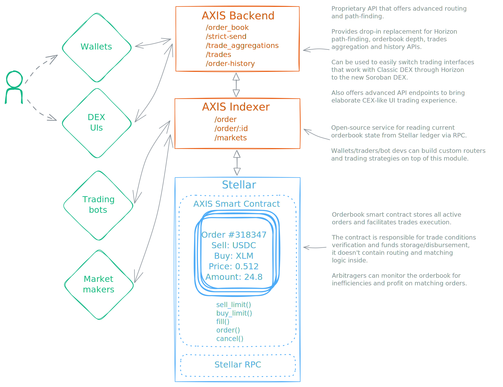

# AXIS - Stellar limit orderbook on backwards compatible with Classic DEX

_by [StellarExpert](https://stellar.expert) and [Aquarius](https://aqua.network)_

🚧 The project is under active development. We are almost ready to show it to the world )

We ♡ Stellar DEX and we want to introduce AXIS – the next generation smart contract limit orderbook DEX with Classic DEX backwards compatibility.

The smart contract itself and indexer/API service are open-source, so anyone will be able to trade with the orderbook.
On top of that we are planning to offer additional APIs, JS SDK and tooling to provide a programming interface fully backwards compatible with Horizon, hugely simplifying the transition for any existing wallet or trading interface that supports Stellar DEX.

In addition to standard limit orders, the orderbook will also have extension capabilities to support advanced order types to provide CEX-like trading experience: stop-loss, trailing stop-loos, fill-or-kill, iceberg, etc.

