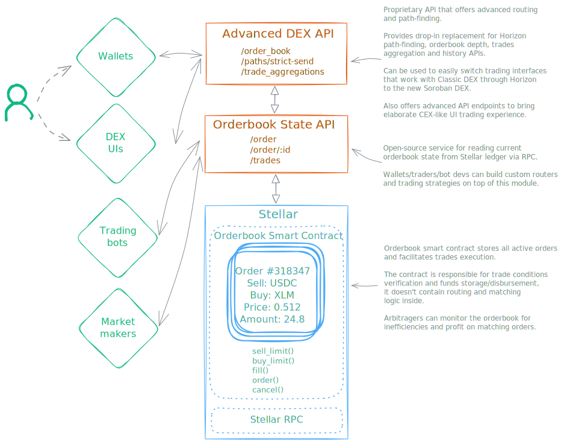

# AXIS - Stellar limit orderbook backwards compatible with Classic DEX

_by [StellarExpert](https://stellar.expert) and [Aquarius](https://aqua.network)_

We ♡ Classic Stellar DEX so we designed AXIS – the next generation smart contract limit orderbook DEX
backwards compatible with Classic DEX.

## Functionality

#### For Wallets

- Access to orderbook liquidity on Soroban
- Integration via backwards-compatible Horizon API
- Convenient path-finding for optimal trade execution

#### For Stellar DEX UIs

- Transition from Classic DEX with minimum code changes
- Everything for trading interfaces using Advanced DEX API
- Data for sophisticated order book visualization

#### For Trading Bots

- Custom routing and arbitrage opportunities
- Access to real-time orderbook state via open-source indexer
- Profits from matching orders and removing orderbook inefficiencies

#### For Market Makers

- Limit-order market-making in smart contracts realm
- Composability with other Soroban protocols
- Permissionless trading pairs listing

---

## Technical Architecture

### Orderbook Smart Contract ([🔗source](https://github.com/axis-markets/orderbook))

Stores all active orders on-chain, maintains order state, provides decentralized access to exchange functionality. The smart contract does NOT contain routing and matching logic (kept off-chain), it is only responsible for trade conditions verification and actual order execution.

Core Functions:

- `sell_limit()` - Trade with DEX and create sell limit order if quote not executed in full
- `buy_limit()` - Same as sell_limit() but creates a buy order
- `fill()` - Execute a trade with matched orders
- `fill_order()` - Fill existing orders using another crossing order from the orderbook
- `order()` -  Fetch order params from the orderbook
- `cancel()` - Remove an order form the orderbook

### AXIS Indexer

Open-source service that scans AXIS events and maintains current orderbook state in memory.
It enables anyone to build custom routers and trading strategies for trading with AXIS on top of this module.

For wallets, traders, bot developers building custom routers and trading strategies.

API Endpoints:

- `/markets`  - Returns the list of all active DEX markets
- `/order/:id` - Specific order details
- `/order` - Queries active DEX orders

### AXIS Backend

Proprietary API service that offers advanced routing and path-finding. Provides drop-in replacement for Horizon
path-finding, orderbook depth, trades aggregation and history APIs.  
Allows existing DEX interfaces that work with Classic Stellar DEX through Horizon to switch to Soroban DEX seamlessly.
Offers everything required for building an elaborate, CEX-like UI.

API Endpoints:

- `/order_book` - Full order book depth
- `/strict-send` and `/strict-receive` - Path-finding for routing
- `/trade_aggregations` - OHLCV and aggregated trading data
- `/trades` - Trading history for a given trader or market pair
- `/order-history` - Access to archived (executed or cancelled) orders

### SDKs

Libs and packages that provide basic scaffolding for AXIS integration that allows to streamline developer experience
and speed up the integration process.

---

### Key Principles

#### Separation of Concerns

- On-Chain: Pure execution and state management
- Off-Chain: Complex routing, matching, and path-finding logic
- API Layer: Compatibility, indexing, and user experience

#### Backwards Compatibility Strategy

Existing wallets/DEXs built for Classic Stellar DEX, so we offer Horizon-like API layer, vastly
reducing the migration friction for developers.

#### Scalability Through Decoupling

- Smart contract handles only verification and execution – minimal transaction fees, efficient execution, reduced attack
surface
- Matching engine operates off-chain – no blockchain bottleneck
- Decentralized matching – multiple matchers can compete for order execution

#### Open Architecture

- Open-source code allows community verification
- Orders are available on-chain, anyone can trade with the DEX
- Orderbook indexer is open-source providing great extensibility
- Traders can develop sophisticated trading strategies and bots
- Permissionless trading pairs listing
- Multiple competing traders prevent monopolies
- Arbitragers balance orderbook markets through profit incentive

---

## Next

This is the first phase. AXIS evolves, we are planning to introduce extension capabilities and support for
advanced order types to offer CEX-like trading experience: stop-loss, trailing stop-loos, fill-or-kill, iceberg, etc.  
And after that? ZK and L2, but we'll talk about this later 😉 